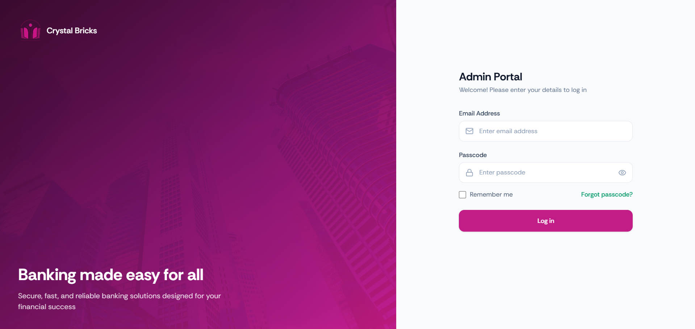
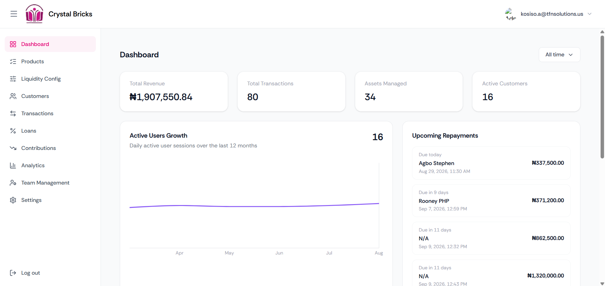
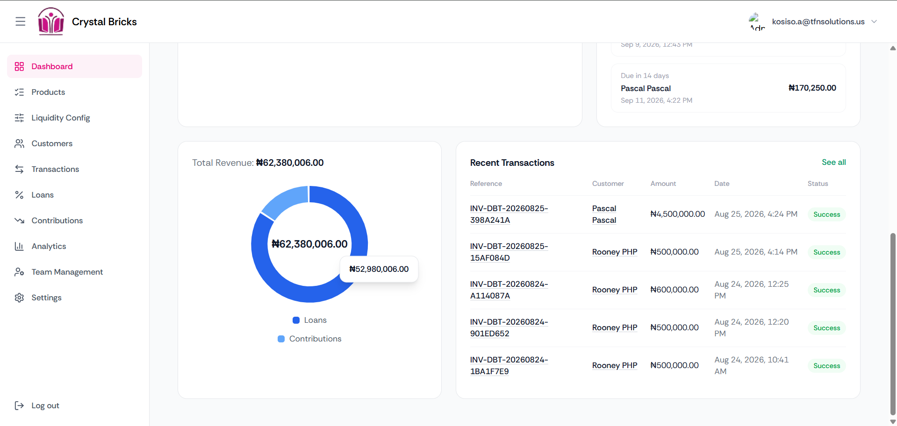
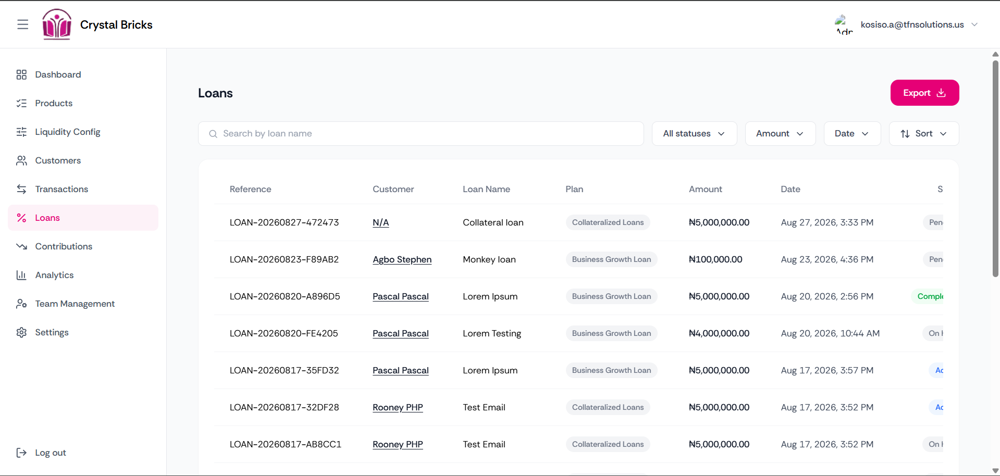
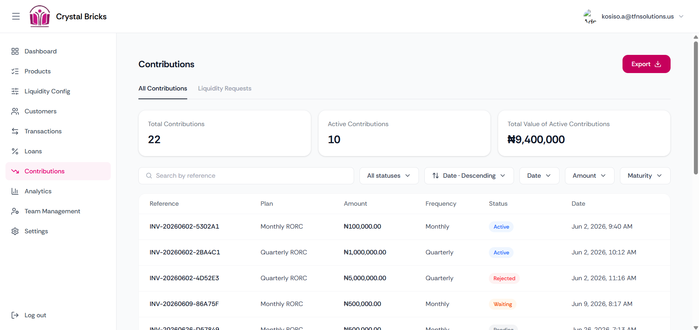

# Crystal Bricks Admin Portal

> Administrative dashboard for managing the Crystal Bricks platform.

## Overview

Crystal Bricks Admin is a web-based administrative portal for managing the Crystal Bricks platform.

The portal is used by authorized team members to manage customers, loan requests, contributions, transactions, loan/contribution plans, liquidation rates, and other platform operations.

Access to administrative functionality is controlled through role-based permissions.

## Features

- **Admin Authentication** — Secure authentication for administrative users.
- **Analytics & Dashboard** — View platform statistics, charts, and key metrics over selected periods.
- **Contribution Management** — View contributions and process liquidation requests.
- **Customer Management** — View customer details and activate/deactivate customer accounts.
- **Liquidation Penalty Rate Management** — View, edit, and activate/deactivate liquidation penalty rates.
- **Loan Request Management** — View, review, and process loan requests.
- **Plan (or Product) Management** — View, edit, and activate/deactivate loan/contribution plans.
- **Platform Settings** — Manage the authenticated administrator's account details.
- **Team Management** — Manage team members, roles, account status, and role permissions.
- **Transaction Management** — View transactions and their details.

## Tech Stack

- **Framework:** React 19
- **Build Tool:** Vite 8
- **Styling:** Tailwind CSS 4
- **Routing:** React Router DOM 7
- **HTTP Client:** Axios
- **Charts:** Recharts
- **Icons:** Lucide React
- **Excel Exports:** SheetJS (xlsx)

## Screenshots











## Prerequisites

- Node.js (v18 or higher recommended. Original machine's version: v22.19.0)
- npm

## Installation & Setup

1. Clone the repository:

   ```bash
   git clone <repository-url>
   cd crystalbricks-admin
   ```

2. Install dependencies:

   ```bash
   npm install
   ```

3. Create a `.env` file in the project root and configure the required environment variables (see [Environment Variables](#environment-variables)).

4. Start the development server:

   ```bash
   npm run dev
   ```

## Environment Variables

The following environment variables must be defined in a `.env` file at the project root:

| Variable                  | Description                      |
| ------------------------- | -------------------------------- |
| `VITE_ID_API_URL`         | Base URL for the identity API    |
| `VITE_WALLET_API_URL`     | Base URL for the wallet API      |
| `VITE_WALLET_STORAGE_URL` | Base URL for wallet file storage |

> **Note:** Do not commit your `.env` file or expose credentials/secrets in the repository.

## Project Structure

```text
src/
├── assets/              # Static assets used by the application
├── features/            # Feature-specific modules
│   └── analytics/
│   │   ├── api/         # Analytics API calls
│   │   ├── helpers/     # Analytics-specific helper functions
│   │   ├── mocks/       # Mock data
│   │   └── pages/       # Analytics pages
│   └──...               # Other modules
├── routes/              # Application route definitions
├── services/            # Shared API/service integrations
├── shared/              # Reusable application resources
│   ├── components/      # Reusable UI components
│   ├── context/         # React Context providers
│   └── utils/           # Generic utility functions
├── App.jsx              # Root application component
├── index.css            # Global styles
└── main.jsx             # Application entry point
```

## Usage

After signing in, administrators can access the dashboard and navigate
to the various management modules based on their assigned permissions.

Common workflows include:

1. Reviewing dashboard statistics
2. Reviewing loan requests
3. Processing liquidation requests
4. Managing customers
5. Managing loan/contribution plans
6. Reviewing transactions
7. Managing team members and permissions, etc.

<!-- ## Deployment

Not available at the moment. -->

## Available Scripts

| Command           | Description                          |
| ----------------- | ------------------------------------ |
| `npm run dev`     | Start the development server         |
| `npm run build`   | Build the application for production |
| `npm run preview` | Preview the production build locally |
| `npm run lint`    | Run ESLint                           |
